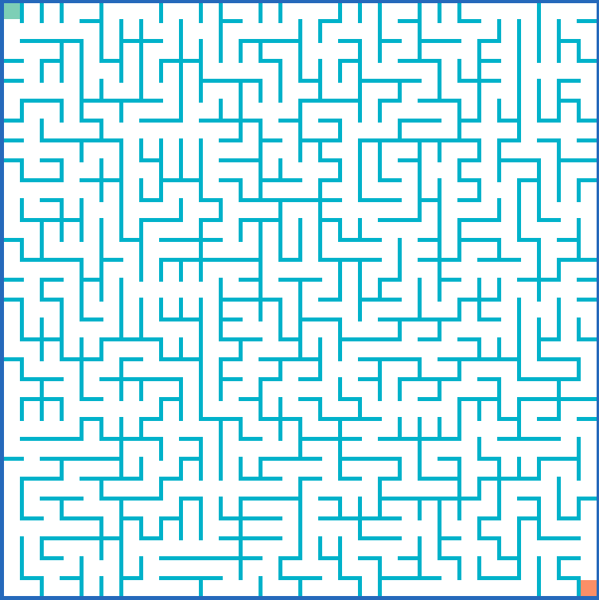
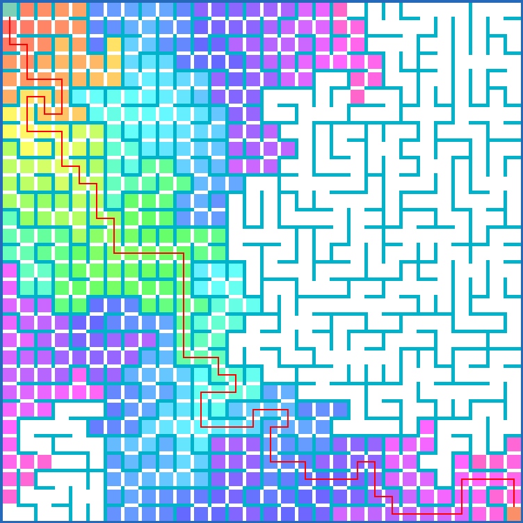
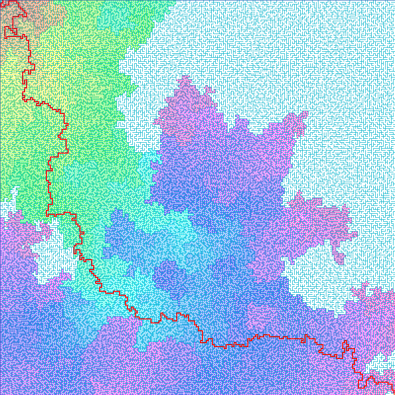
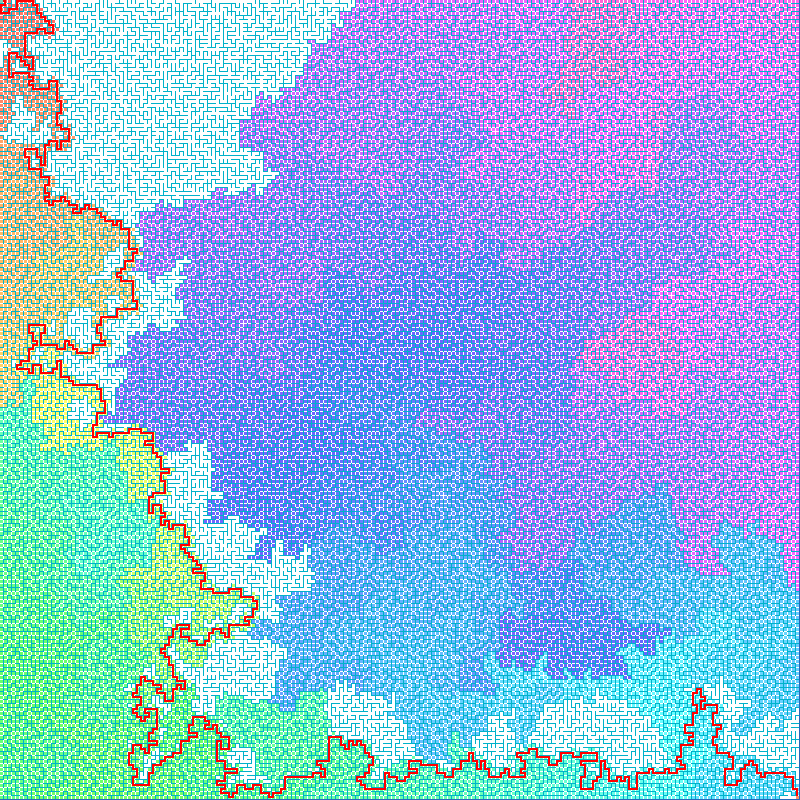
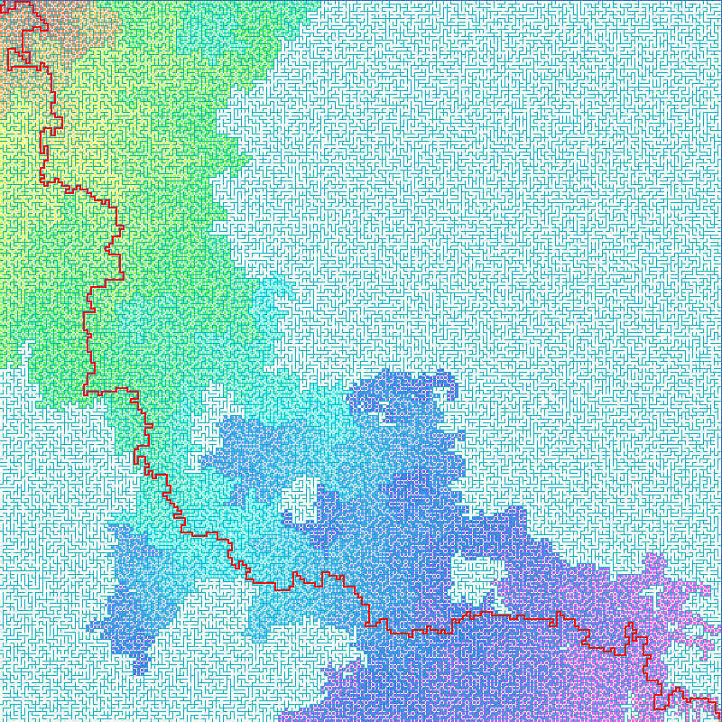
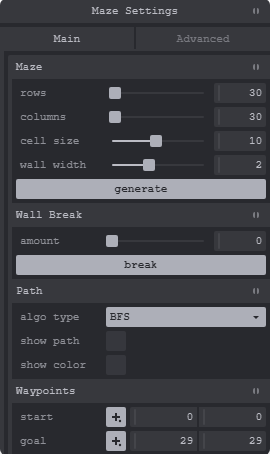
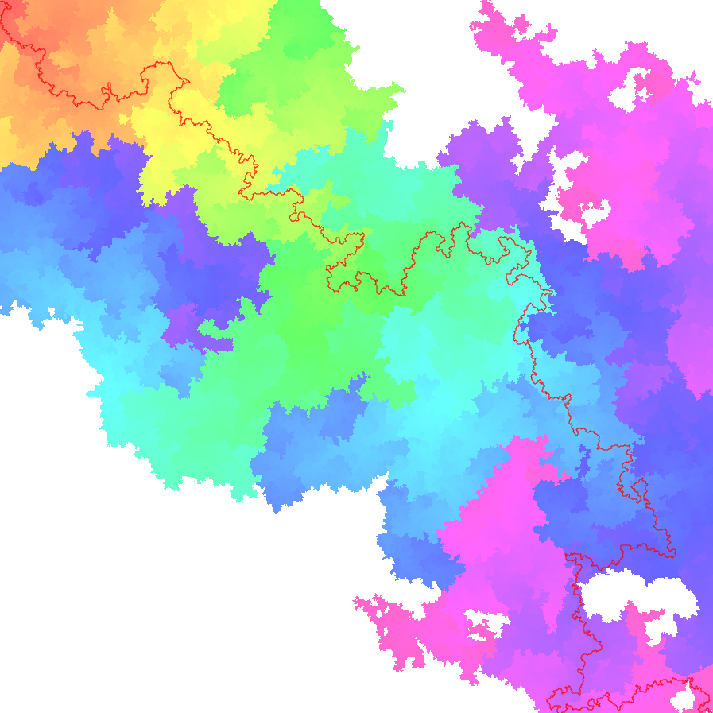

# [Maze Generator and Solver](https://jasonoh3.github.io/maze-app/)

Explore a visual and interactive maze featuring [Wilson's maze generator](#wilsons-algorithm) and [BFS](#breadth-first-search-️️️️️), [DFS](#depth-first-search-), and [A* search](#a-search-) solvers (with Manhattan, Euclidean, and Dijkstra heuristics)!

## Algorithms 🖥️

### Wilson's Algorithm ꡙ‍ ꡌ‍ ꡚ‍

Efficiently generates uniform spanning trees using loop-erased random walks. The algorithm can generate a 1,000 x 1,000 maze (1,000,000 nodes/vertices) in ~3 seconds.

### Breadth First Search 🚶‍♂️🚶‍♀️🚶‍♂️🚶‍♀️🚶‍♂️

Uses queues to search and solve the maze. Does find the shortest path but not necessarily optimal.

### Depth First Search 📚

Uses stacks to search and solve the maze. Does not necessarily find the shortest path.

### A* Search 🌟

Uses a priority queue and maze-oriented heuristics (i.e., Manhattan, Euclidean, Dijkstra) to search and solve mazes optimally. Does find the optimal*, shortest path.

## ✨Customize Your Maze!✨

## Color Depth Map 🌈

Utilizing the search algorithms, a depth color map is generated and visualized on the maze, showcasing how the algorithm searches from start to end. The less color shown means, the less the algorithm needed to search.

## Panning 🖱️ and Zooming 🔍

- Panning :arrow_right: Left click and drag
- Zooming :arrow_right: Scroll wheel